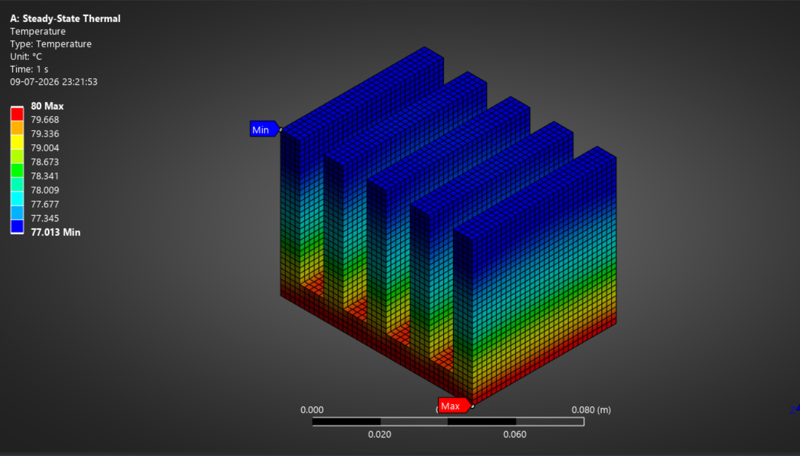
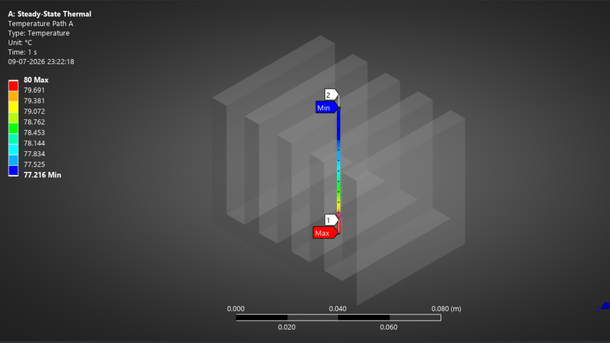
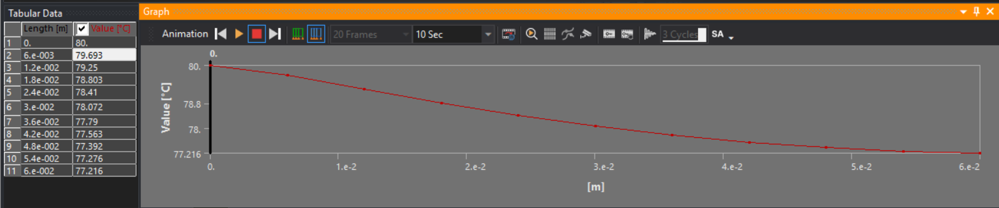
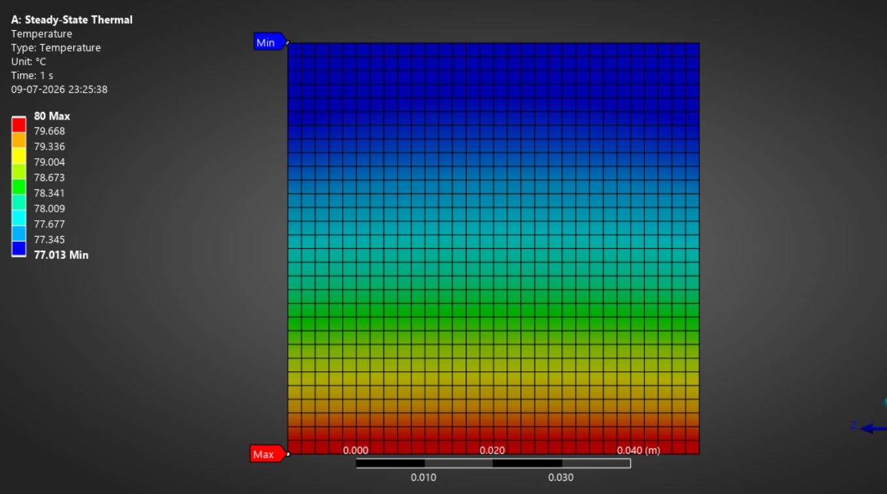

# Steady-State Heat Transfer Analysis of Rectangular Fin Array — ANSYS Workbench

   

## Project Overview

This project presents a 3D Steady-State Thermal analysis of a rectangular fin array using ANSYS Workbench Mechanical. A hot base plate with five rectangular copper fins is cooled by ambient air through convection. The simulation predicts the temperature distribution across the fin height and is validated against classical fin conduction theory.

Fin arrays of this type are used extensively in heat sinks, electronics cooling, and thermal management systems in aerospace and automotive applications.

---

## Problem Definition

A hot surface is cooled by attaching rectangular fins to it. The fins are mounted on a rectangular base plate. The objective is to determine the temperature distribution along the fin height under steady-state conditions.

---

## Geometry and Material Properties

| Parameter | Value |
|---|---|
| Base Plate Thickness | 1.0 cm |
| Base Plate Width (W) | 8.0 cm |
| Base Plate Length (L) | 6.0 cm |
| Fin Height (Hf) | 5.0 cm |
| Fin Length | 6.0 cm |
| Fin Thickness (tf) | 0.8 cm |
| Spacing Between Fins (b) | 1.0 cm |
| Number of Fins | 5 |
| Material | Copper |
| Density | 9000 kg/m³ |
| Thermal Conductivity (k) | 400 W/m·°C |
| Specific Heat Capacity | 385 J/kg·°C |

---

## Boundary Conditions

| Condition | Value |
|---|---|
| Base Plate Temperature | 80 °C |
| Ambient Air Temperature | 20 °C |
| Convective Heat Transfer Coefficient (h) | 38 W/m²·°C |
| Analysis Type | 3D Steady-State Thermal |

---

## Simulation Workflow

```
1. Geometry built in ANSYS DesignModeler — base plate with 5 rectangular fins
2. Material assigned — Copper (k = 400 W/m.C)
3. Mesh generated — structured hexahedral elements
4. Boundary conditions applied:
   - Fixed temperature (80C) on base plate
   - Convection (h = 38 W/m2.C, Ta = 20C) on all exposed fin surfaces
5. Steady-State Thermal solver run — solution converged
6. Temperature path plotted along fin height (base to tip)
7. Results post-processed and validated against analytical fin theory
```

---

## Results

### 3D Temperature Distribution


The temperature contour shows the expected thermal gradient — maximum temperature (80°C, red) at the base plate, decreasing toward the fin tips (77.0°C, blue) as heat is convected away by the surrounding air.

**Temperature Range: 77.01°C to 80.00°C**

---

### Temperature Path Along Fin Height


A path was defined from the fin base to the fin tip to extract the precise temperature profile along the conduction direction.

---

### Temperature Profile Graph


The temperature decreases smoothly and non-linearly from 80°C at the base to 77.22°C at the tip. This curved profile — rather than a straight line — is the signature of fin conduction with convective losses along the length, consistent with the hyperbolic cosine temperature distribution predicted by fin theory.

---

### Cross-Section Temperature Distribution


A single fin cross-section confirms the temperature gradient is uniform across the fin width, with heat flowing purely in the height direction — validating the 1D fin conduction assumption used for analytical comparison.

---

## Validation Against Analytical Fin Theory

The simulation results were validated against the classical fin conduction equation for a rectangular fin with a convective tip condition:

```
θ(x)/θb = [cosh(m(L-x)) + (h/mk)sinh(m(L-x))] / [cosh(mL) + (h/mk)sinh(mL)]

where:
  m = sqrt(hP / kAc)
  P = fin perimeter = 2(tf + L)
  Ac = fin cross-sectional area = tf × L
```

| Parameter | Value |
|---|---|
| m (fin parameter) | 5.188 m⁻¹ |
| mL | 0.259 |
| Fin Efficiency (theory) | 97.82% |
| Theoretical Heat Dissipation per Fin | 16.24 W |

### Comparison Table

| Parameter | ANSYS Simulation | Analytical Theory | Error |
|---|---|---|---|
| Base Temperature | 80.00 °C | 80.00 °C | — |
| Fin Tip Temperature | 77.01 °C | 77.77 °C | 0.76 °C (1.26%) |

The simulated tip temperature matches the analytical prediction within **1.26% error**, confirming the accuracy of the mesh, boundary conditions, and solver setup.

---

## Tools Used

| Tool | Purpose |
|---|---|
| ANSYS DesignModeler | Fin array geometry construction |
| ANSYS Mechanical (Steady-State Thermal) | Conduction-convection thermal solver |
| Python | Analytical fin theory validation |

---

## Key Learnings

- Rectangular fins with convective tips produce a hyperbolic, non-linear temperature profile rather than a linear one
- Analytical fin theory (using the fin parameter m and efficiency η) provides a fast, reliable check on FEA results
- A 1.26% deviation between simulation and hand-calculation reflects the convective tip assumption and mesh-related numerical diffusion
- Fin efficiency of 97.8% indicates the copper fins are performing close to their theoretical maximum heat dissipation capacity for this geometry

---

## Related Projects

- [NACA 0012 Airfoil CFD Analysis](https://github.com/Clasher152003/naca0012-cfd-ansys-fluent) — External aerodynamics
- [De Laval Rocket Nozzle CFD Analysis](https://github.com/Clasher152003/deleval-nozzle-cfd-ansys-fluent) — Compressible internal flow

---

## Author

**Ravindra Singh**
Aerospace Engineering Graduate
Simulation Engineer | CFD & FEA | ANSYS | MATLAB
📧 shekhawatravinder152003@gmail.com

---

## References

- Incropera, F.P. and DeWitt, D.P. — Fundamentals of Heat and Mass Transfer, Wiley
- ANSYS Mechanical Thermal Analysis Guide 2026 R1
